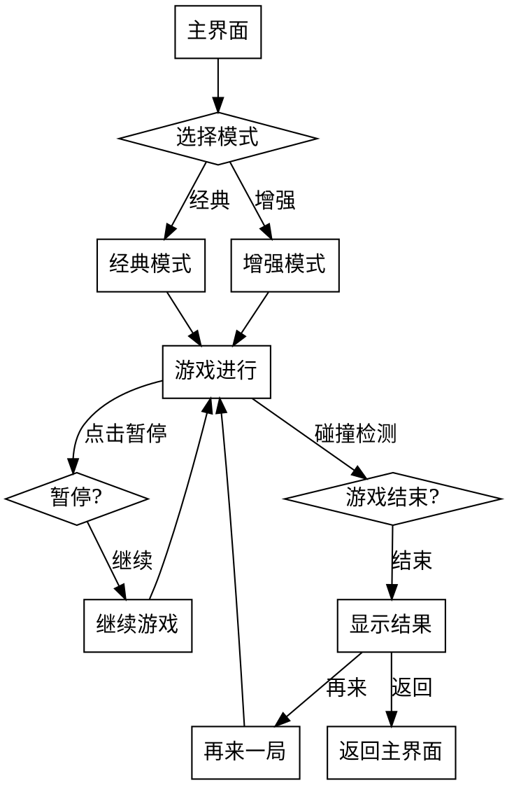

# 贪吃蛇游戏设计文档

## 1. 概述

| 属性 | 内容 |
|------|------|
| **工具名称** | 贪吃蛇 (Snake) |
| **分类** | 游戏 (Game) |
| **主要平台** | 移动端（Android/iOS） |
| **版本** | 1.0.0 |

## 2. 功能需求

### 2.1 游戏模式

#### 经典模式
- 蛇吃食物变长，撞墙或撞自己游戏结束
- 无特殊道具，纯粹考验操作
- 简单直接，适合休闲玩家

#### 增强模式
- 在经典模式基础上增加道具和障碍物
- 提供更丰富的游戏体验

### 2.2 道具系统

| 道具 | 图标 | 效果 | 持续时间 |
|------|------|------|----------|
| 加速道具 | ⚡ | 移动速度加快 | 5秒 |
| 缩短道具 | ✂️ | 蛇身减少2节 | 即时 |
| 磁铁道具 | 🧲 | 自动吸引2格范围内的食物 | 5秒 |

### 2.3 障碍物
- 随机出现的方块
- 碰到即游戏结束
- 增强模式专属

### 2.4 难度系统

渐进难度设计：
- 初始移动间隔：200ms
- 最短移动间隔：80ms
- 随分数增加逐渐加速

### 2.5 计分系统
- 吃食物：+1分
- 吃道具：+2分
- 最高分本地存储
- 再次打开应用显示历史最高分

## 3. 界面设计

### 3.1 主界面

```
┌─────────────────────────────┐
│  ←  贪吃蛇          经典|增强 │  ← AppBar + 模式切换
├─────────────────────────────┤
│                             │
│    🍎 10                    │  ← 分数显示
│                             │
│  ┌─────────────────────┐   │
│  │ ■ ■ ■ ■ ■ ■ ■ ■ ■ ■ │   │
│  │ ■                 ■ │   │
│  │ ■    🍎          ■ │   │
│  │ ■      ████      ■ │   │  ← 游戏区域
│  │ ■        ██      ■ │   │     （带边框墙壁）
│  │ ■                 ■ │   │
│  │ ■ ■ ■ ■ ■ ■ ■ ■ ■ ■ │   │
│  └─────────────────────┘   │
│                             │
│        最高分: 50           │  ← 最高分显示
│                             │
│      [ 开始游戏 ]           │  ← 开始按钮
│                             │
└─────────────────────────────┘
```

### 3.2 游戏进行中界面

```
┌─────────────────────────────┐
│  ←  贪吃蛇        ⏸️  🔄    │  ← 暂停 / 重开
├─────────────────────────────┤
│    分数: 25   长度: 8       │  ← 实时数据
├─────────────────────────────┤
│                             │
│  ┌─────────────────────┐   │
│  │ ■ ■ ■ ■ ■ ■ ■ ■ ■ ■ │   │
│  │ ■   🧲            ■ │   │
│  │ ■    🍎   ████    ■ │   │
│  │ ■      ████ ██    ■ │   │
│  │ ■            ██    ■ │   │
│  │ ■ ■ ■ ■ ■ ■ ■ ■ ■ ■ │   │
│  └─────────────────────┘   │
│                             │
│     ← 滑动控制方向 →        │
│                             │
└─────────────────────────────┘
```

### 3.3 游戏结束弹窗

```
┌─────────────────────────┐
│       游戏结束          │
│                         │
│    本次得分: 25         │
│    最高记录: 50         │
│                         │
│  [ 再来一局 ]  [ 返回 ] │
└─────────────────────────┘
```

### 3.4 视觉风格

- **整体风格**：现代扁平风
- **蛇身**：圆角矩形，渐变色填充
- **食物**：圆点，醒目颜色
- **道具**：带图标标识的方块
- **障碍物**：实心方块
- **墙壁**：细边框线

## 4. 交互设计

### 4.1 控制方式

**滑动手势控制**
- 上滑：蛇向上移动
- 下滑：蛇向下移动
- 左滑：蛇向左移动
- 右滑：蛇向右移动

**规则**
- 不能反向移动（如正在向上时不能直接下滑）
- 滑动响应区域为整个游戏画面
- 支持快速连续滑动预判方向

### 4.2 游戏流程



## 5. 技术架构

### 5.1 文件结构

```
app/lib/tools/snake/
├── snake_tool.dart          # 工具注册入口
├── snake_page.dart          # 主页面（模式选择、开始界面）
├── snake_game_page.dart     # 游戏进行页面
├── snake_board.dart         # 游戏区域绘制
├── snake_logic.dart         # 游戏逻辑（移动、碰撞检测）
├── snake_models.dart        # 数据模型
└── snake_settings.dart      # 设置（可选）
```

### 5.2 数据模型

```dart
/// 蛇的移动方向
enum Direction { up, down, left, right }

/// 蛇身
class SnakeBody {
  List<Offset> segments;  // 蛇身各节位置
  Direction direction;     // 当前移动方向
}

/// 道具类型
enum PowerUpType { speed, shorten, magnet }

/// 道具
class PowerUp {
  Offset position;        // 位置
  PowerUpType type;       // 类型
  int remainingTime;      // 剩余时间（毫秒）
}

/// 游戏模式
enum GameMode { classic, enhanced }

/// 游戏状态
class SnakeState {
  SnakeBody snake;           // 蛇
  Offset food;               // 食物位置
  List<Offset> obstacles;    // 障碍物（增强模式）
  PowerUp? powerUp;          // 当前道具
  PowerUp? activePowerUp;    // 激活的道具效果
  int score;                 // 当前分数
  int highScore;             // 最高分
  GameMode mode;             // 游戏模式
  bool isPlaying;            // 是否游戏中
  bool isPaused;             // 是否暂停
  int moveInterval;          // 当前移动间隔（毫秒）
}
```

### 5.3 游戏逻辑

#### 移动机制
- 游戏区域采用网格坐标系（如 20×20）
- 蛇身用 `List<Offset>` 存储
- 每次移动：头部添加新位置，尾部移除
- 吃食物时：头部添加新位置，尾部不移除

#### 碰撞检测
1. 墙壁碰撞：蛇头坐标超出边界
2. 自身碰撞：蛇头与任意蛇身坐标重叠
3. 障碍物碰撞：蛇头与障碍物坐标重叠

#### 道具生成逻辑
- 食物：始终存在一个，被吃后随机生成
- 道具：概率生成，同屏最多1个
- 障碍物：增强模式下随机生成

#### 难度递增
```dart
// 根据分数计算移动间隔
int calculateMoveInterval(int score) {
  // 初始 200ms，每10分减少10ms，最短 80ms
  int interval = 200 - (score ~/ 10) * 10;
  return interval.clamp(80, 200);
}
```

### 5.4 数据存储

使用 SharedPreferences 存储最高分：

```dart
class SnakeStorage {
  static const _highScoreKey = 'snake_high_score';
  static const _highScoreClassicKey = 'snake_high_score_classic';
  static const _highScoreEnhancedKey = 'snake_high_score_enhanced';

  Future<int> getHighScore(GameMode mode) async {
    final prefs = await SharedPreferences.getInstance();
    final key = mode == GameMode.classic
      ? _highScoreClassicKey
      : _highScoreEnhancedKey;
    return prefs.getInt(key) ?? 0;
  }

  Future<void> saveHighScore(GameMode mode, int score) async {
    final prefs = await SharedPreferences.getInstance();
    final key = mode == GameMode.classic
      ? _highScoreClassicKey
      : _highScoreEnhancedKey;
    await prefs.setInt(key, score);
  }
}
```

## 6. 性能考虑

### 6.1 渲染优化
- 使用 `CustomPainter` 绘制游戏画面
- 仅在状态变化时重绘
- 避免在游戏循环中创建新对象

### 6.2 手势处理
- 使用 `GestureDetector` 处理滑动手势
- 计算滑动方向，忽略小幅滑动

## 7. 测试要点

### 7.1 功能测试
- [ ] 经典模式基本游戏流程
- [ ] 增强模式道具效果
- [ ] 障碍物碰撞检测
- [ ] 渐进难度验证
- [ ] 最高分保存与读取
- [ ] 暂停/继续功能
- [ ] 游戏结束判定

### 7.2 边界测试
- [ ] 蛇头反向移动阻止
- [ ] 食物不生成在蛇身上
- [ ] 道具不生成在障碍物上
- [ ] 游戏区域边界碰撞

### 7.3 性能测试
- [ ] 蛇身很长时（100+节）的帧率
- [ ] 长时间游戏的内存占用

## 8. 后续扩展

### 8.1 可能的功能扩展
- 多种蛇皮肤
- 自定义游戏区域大小
- 音效和震动反馈
- 排行榜系统
- 成就系统

### 8.2 预留接口
- `SnakeSettings` 类预留设置功能
- `SnakeState` 支持序列化/反序列化

---

**文档版本**：1.0
**创建日期**：2026-03-23
**状态**：待实现