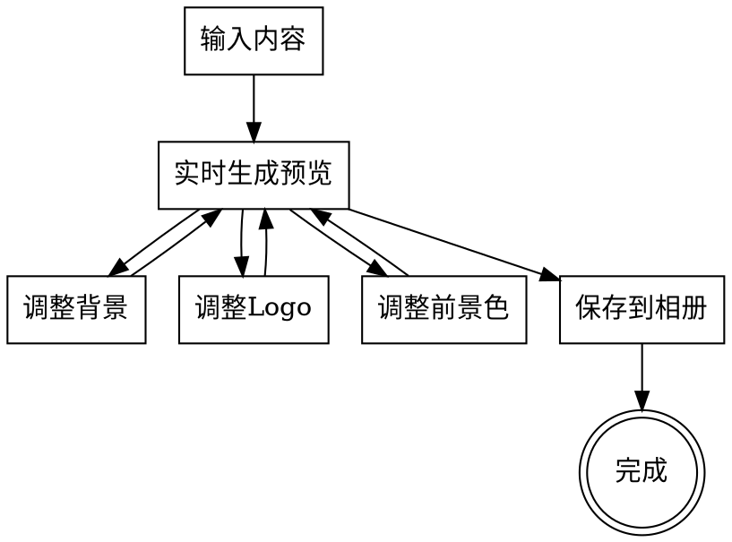

# 二维码生成器设计文档

## 1. 概述

| 属性 | 内容 |
|------|------|
| **工具名称** | 二维码生成器 (QRCode) |
| **分类** | 实用工具 |
| **主要平台** | 移动端（Android/iOS） |
| **版本** | 1.0.0 |

## 2. 功能需求

### 2.1 内容类型

支持两种内容类型：
- **文本** — 任意文本内容
- **网址** — URL 链接

### 2.2 二维码自定义

#### 前景色
- 用户可选择任意颜色
- 默认为黑色

#### 背景设置

| 类型 | 说明 |
|-----|------|
| 纯色（默认） | 用户可选择任意颜色 |
| 预设图片 | 内置背景素材（开发者提供） |
| 自定义图片 | 用户从相册选择 |

#### Logo 设置

| 类型 | 说明 |
|-----|------|
| 无 | 不显示 Logo |
| Emoji | 用户选择任意 Emoji |
| 预设图片 | 内置小图片素材（开发者提供，限制尺寸） |
| 自定义图片 | 用户从相册上传（限制尺寸） |

**Logo 尺寸限制**：
- 建议不超过二维码尺寸的 20-30%
- 过大会影响识别率

### 2.3 操作功能

- **实时预览** — 输入内容、切换样式后立即预览
- **保存到相册** — 将生成的二维码保存为图片

## 3. 界面设计

### 3.1 主界面

```
┌─────────────────────────────────────┐
│  ←  二维码生成器                     │
├─────────────────────────────────────┤
│                                     │
│  ┌─────────────────────────────┐   │
│  │ 输入文本或网址...            │   │  ← 输入框
│  └─────────────────────────────┘   │
│                                     │
│  ┌─────────────────────────────┐   │
│  │                             │   │
│  │      ┌───────────┐          │   │
│  │      │ ▓▓▓▓▓▓▓▓▓ │          │   │
│  │      │ ▓▓▓█▓▓▓▓▓ │   🖼️    │   │  ← 二维码预览区
│  │      │ ▓▓▓▓▓▓▓▓▓ │  (Logo)  │   │     （实时预览）
│  │      │ ▓▓▓▓▓▓▓▓▓ │          │   │
│  │      └───────────┘          │   │
│  │                             │   │
│  └─────────────────────────────┘   │
│                                     │
│  ── 背景设置 ─────────────────────  │
│  [ 纯色 ] [ 预设 ] [ 自定义 ]       │  ← 背景类型切换
│  □ □ □ □ □                         │  ← 颜色/预设选择
│                                     │
│  ── Logo设置 ─────────────────────  │
│  [ 无 ] [ Emoji ] [ 预设 ] [ 自定义 ]│  ← Logo类型切换
│  😀 😎 ❤️ 🌟 ...                    │  ← Emoji/预设选择
│                                     │
│  ── 前景色 ─────────────────────    │
│  □ □ □ □ □                         │  ← 前景色选择
│                                     │
│         [ 💾 保存到相册 ]            │  ← 保存按钮
│                                     │
└─────────────────────────────────────┘
```

### 3.2 视觉风格

- **整体风格**：简洁现代
- **二维码**：支持自定义前景色，背景透明以便叠加
- **背景**：纯色或图片，居中裁剪适配
- **Logo**：居中显示，圆角可选

## 4. 交互设计

### 4.1 操作流程



### 4.2 图片选择

- 选择"自定义"背景或 Logo 时，调用系统图片选择器
- 选择后自动返回主界面并更新预览

## 5. 技术架构

### 5.1 文件结构

```
app/lib/tools/qrcode/
├── qrcode_tool.dart           # 工具注册入口
├── qrcode_page.dart           # 主页面
├── qrcode_service.dart        # 二维码生成与保存服务
└── models/
    └── qrcode_config.dart     # 配置模型

app/assets/
├── images/qrcode/backgrounds/ # 预设背景图片
└── images/qrcode/logos/       # 预设Logo图标
```

### 5.2 数据模型

```dart
/// 内容类型
enum ContentType { text, url }

/// 背景类型
enum BackgroundType { solid, preset, custom }

/// Logo类型
enum LogoType { none, emoji, preset, custom }

/// 二维码配置
class QRCodeConfig {
  String content;                    // 输入内容
  ContentType contentType;           // 内容类型
  Color foregroundColor;             // 前景色（默认黑色）

  // 背景配置
  BackgroundType backgroundType;     // 背景类型
  Color solidBackgroundColor;        // 纯色背景颜色（默认白色）
  String? presetBackgroundId;        // 预设背景ID
  String? customBackgroundPath;      // 用户自定义背景路径

  // Logo配置
  LogoType logoType;                 // Logo类型
  String? emojiLogo;                 // Emoji 字符
  String? presetLogoId;              // 预设Logo ID
  String? customLogoPath;            // 用户自定义Logo路径
  double logoSize;                   // Logo大小比例（默认0.2）
}
```

### 5.3 核心服务

#### 二维码生成服务

```dart
class QRCodeService {
  /// 生成二维码图片
  Future<Uint8List?> generateQRCode(QRCodeConfig config) async {
    // 1. 使用 qr_flutter 生成基础二维码
    // 2. 根据配置合成背景
    // 3. 根据配置添加 Logo
    // 4. 返回最终图片字节
  }

  /// 合成背景
  Future<Uint8List> _compositeWithBackground(
    Uint8List qrBytes,
    QRCodeConfig config,
  ) async {
    // 使用 Stack 方式合成背景图与二维码
  }

  /// 添加 Logo
  Future<Uint8List> _addLogo(
    Uint8List qrWithBackground,
    QRCodeConfig config,
  ) async {
    // 在二维码中心添加 Logo
  }

  /// 保存到相册
  Future<bool> saveToGallery(Uint8List imageBytes) async {
    // 保存临时文件并使用 gal 保存到相册
  }
}
```

### 5.4 依赖

```yaml
dependencies:
  qr_flutter: ^4.1.0  # 二维码生成
  # 以下已存在于项目中
  image_picker: ^1.0.7  # 图片选择
  gal: ^2.0.0           # 保存到相册
  path_provider: ^2.1.0 # 路径获取
```

## 6. 实现要点

### 6.1 二维码生成

```dart
Widget buildQRCodePreview(QRCodeConfig config) {
  return Stack(
    alignment: Alignment.center,
    children: [
      // 背景层
      _buildBackground(config),

      // 二维码层（透明背景）
      QrImageView(
        data: config.content,
        size: 200,
        backgroundColor: Colors.transparent,
        eyeStyle: QrEyeStyle(
          eyeShape: QrEyeShape.square,
          color: config.foregroundColor,
        ),
        dataModuleStyle: QrDataModuleStyle(
          dataModuleShape: QrDataModuleShape.square,
          color: config.foregroundColor,
        ),
      ),

      // Logo层
      if (config.logoType != LogoType.none)
        _buildLogo(config),
    ],
  );
}
```

### 6.2 Logo 尺寸控制

```dart
// Logo 大小不超过二维码的 20-30%
Widget _buildLogo(QRCodeConfig config) {
  final logoSize = 200 * config.logoSize; // 200 是二维码尺寸
  return Container(
    width: logoSize,
    height: logoSize,
    decoration: BoxDecoration(
      color: Colors.white,
      borderRadius: BorderRadius.circular(8),
    ),
    child: _getLogoWidget(config),
  );
}
```

### 6.3 保存图片

```dart
Future<void> saveQRCode() async {
  // 使用 RepaintBoundary 捕获 Widget
  final RenderRepaintBoundary boundary =
      _globalKey.currentContext!.findRenderObject();

  final image = await boundary.toImage(pixelRatio: 3.0);
  final byteData = await image.toByteData(format: ImageByteFormat.png);

  // 保存到相册
  final tempDir = await getTemporaryDirectory();
  final file = File('${tempDir.path}/qrcode_${DateTime.now().millisecondsSinceEpoch}.png');
  await file.writeAsBytes(byteData!.buffer.asUint8List());

  await Gal.putImage(file.path);
}
```

## 7. 测试要点

### 7.1 功能测试

- [ ] 文本内容生成二维码
- [ ] 网址内容生成二维码
- [ ] 前景色自定义
- [ ] 纯色背景切换
- [ ] 预设背景图切换
- [ ] 自定义背景图选择
- [ ] Emoji Logo 选择
- [ ] 预设 Logo 选择
- [ ] 自定义 Logo 上传
- [ ] 保存到相册功能

### 7.2 边界测试

- [ ] 空内容时的处理
- [ ] 超长内容的处理
- [ ] Logo 尺寸限制验证
- [ ] 背景图裁剪适配
- [ ] 生成的二维码可被扫描识别

### 7.3 性能测试

- [ ] 实时预览的响应速度
- [ ] 图片合成的内存占用

## 8. 后续扩展

### 8.1 可能的功能扩展

- 更多二维码样式（圆角、点状等）
- 二维码扫描功能
- 历史记录
- 批量生成

### 8.2 资源预留

- 预设背景素材由开发者提供
- 预设 Logo 素材由开发者提供
- 资源路径：`assets/images/qrcode/`

---

**文档版本**：1.0
**创建日期**：2026-03-24
**状态**：待实现